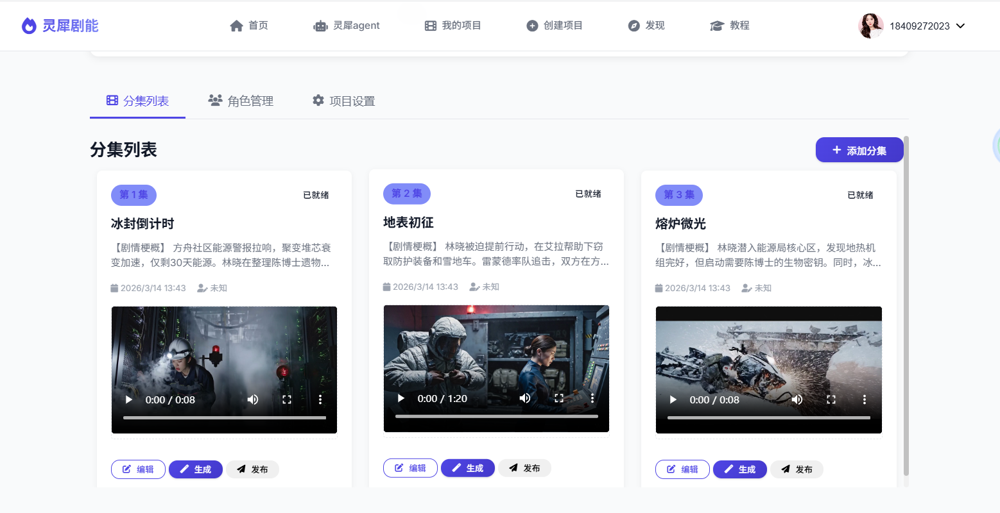
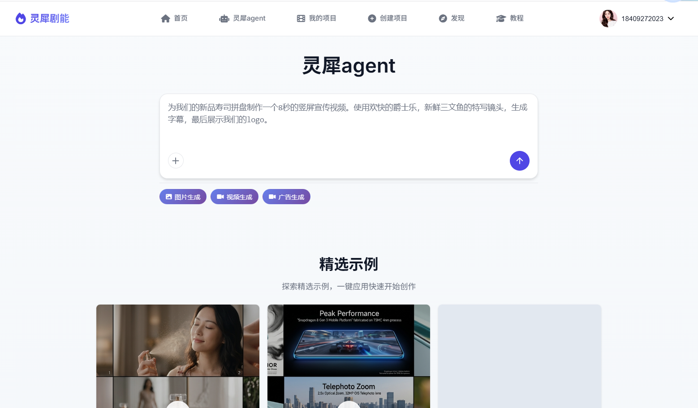
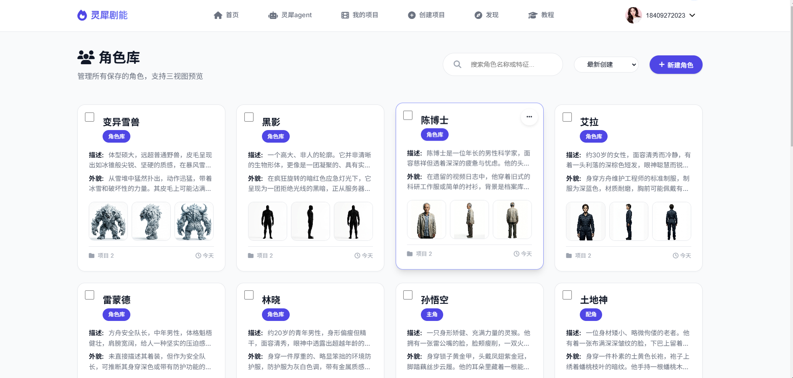
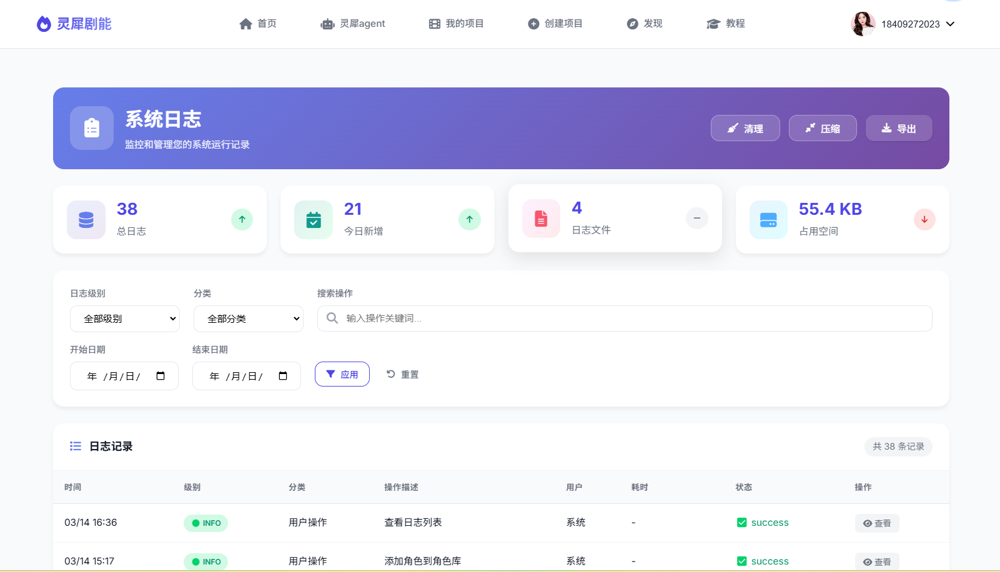
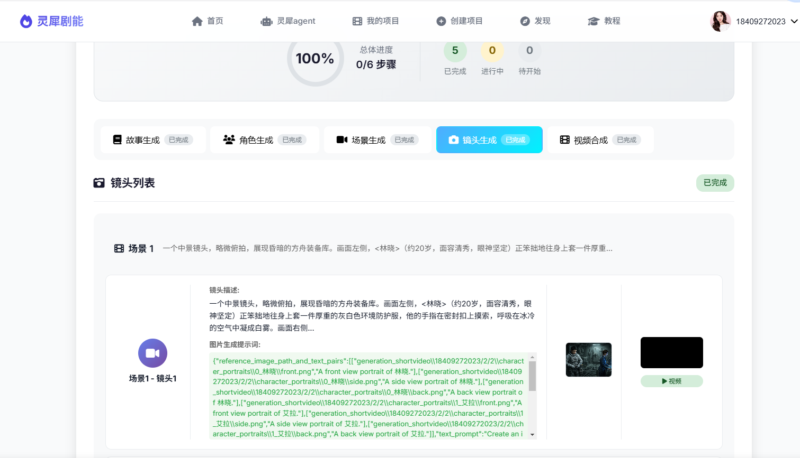
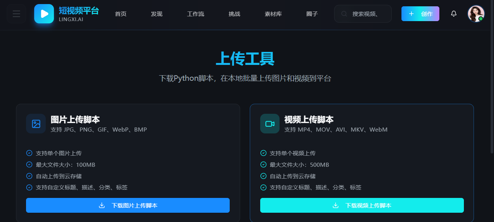

# OpenShortVideo - AI短视频生成平台

## 📖 项目概述

**OpenShortVideo** 是一个基于AI的短视频智能制作平台，集成了剧本创作、角色管理、场景生成、镜头制作等完整的工作流，帮助创作者快速生成高质量的短视频内容。
## demo

<table>
  <tr>
    <th>第1集 冰封倒计时</th>
    <th>第2集 地表初征</th>
    <th>第3集 熔炉微光</th>
  </tr>
  <tr>
    <td>
      <video src="https://backend.appmiaoda.com/projects/supabase268304199530360832/storage/v1/object/public/app-8u3vvyt9el8h_videos/cd0c9a9a-f88f-4037-ac4d-67787035d7c0/1773559871307_uscmr7.mp4" controls width="100%">
        您的浏览器不支持 HTML5 视频播放，请 <a href="https://backend.appmiaoda.com/projects/supabase268304199530360832/storage/v1/object/public/app-8u3vvyt9el8h_videos/cd0c9a9a-f88f-4037-ac4d-67787035d7c0/1773559871307_uscmr7.mp4">点击下载</a>。
      </video>
    </td>
    <td>
      <video src="https://backend.appmiaoda.com/projects/supabase268304199530360832/storage/v1/object/public/app-8u3vvyt9el8h_videos/cd0c9a9a-f88f-4037-ac4d-67787035d7c0/1773560713617_26udhe.mp4" controls width="100%">
        您的浏览器不支持 HTML5 视频播放，请 <a href="https://backend.appmiaoda.com/projects/supabase268304199530360832/storage/v1/object/public/app-8u3vvyt9el8h_videos/cd0c9a9a-f88f-4037-ac4d-67787035d7c0/1773560713617_26udhe.mp4">点击下载</a>。
      </video>
    </td>
    <td>
      <video src="https://backend.appmiaoda.com/projects/supabase268304199530360832/storage/v1/object/public/app-8u3vvyt9el8h_videos/cd0c9a9a-f88f-4037-ac4d-67787035d7c0/1773560751687_16ev0k.mp4" controls width="100%">
        您的浏览器不支持 HTML5 视频播放，请 <a href="https://backend.appmiaoda.com/projects/supabase268304199530360832/storage/v1/object/public/app-8u3vvyt9el8h_videos/cd0c9a9a-f88f-4037-ac4d-67787035d7c0/1773560751687_16ev0k.mp4">点击下载</a>。
      </video>
    </td>
  </tr>
</table>
## ✨ 核心功能

### 🎬 智能视频制作
- **一键生成**：输入简单描述，AI自动生成完整短视频
- **分步生成**：按剧本→角色→场景→镜头的流程精细化制作
- **实时预览**：生成过程中实时查看进度和预览效果
- **配置选项**：支持受众群体、场景数量、镜头数、艺术风格等参数配置

### 🖼️ AI图像生成
- **文生图**：输入描述生成精美图片
- **多风格支持**：支持多种艺术风格
- **异步处理**：后台生成，实时推送进度

### 📹 AI视频生成
- **文生视频**：输入描述生成视频
- **图生视频**：参考图片生成视频
- **Veo3引擎**：集成先进的视频生成能力

### 📢 广告视频生成
- **创意分析**：AI自动分析广告创意需求
- **分镜生成**：自动生成分镜头脚本
- **流程可视化**：实时显示分析→分镜→图片→视频的完整流程

### 👥 角色管理
- **AI角色生成**：自动生成角色形象和特征
- **多角度肖像**：支持正面、侧面、背面全方位展示
- **批量管理**：支持批量导入、编辑和删除角色

### 🎨 场景与镜头
- **智能分镜**：AI分析剧本自动分镜
- **场景管理**：多场景切换和配置
- **镜头预览**：实时查看镜头效果和描述

### 🤖 AI助手（灵犀Agent）
- **智能对话**：通过自然语言交互创作内容
- **多媒体生成**：支持图片生成、视频生成、广告生成
- **Prompt优化**：智能提示词生成和优化
- **内容扩展**：基于输入内容自动扩展创意

### 📁 工作目录管理
- **目录列表**：查看所有生成工作目录
- **继续生成**：支持从已有目录继续生成
- **文件预览**：支持图片、视频在线预览

## 🛠️ 技术栈

### 后端 (Backend)
- **框架**：Python Flask
- **数据库**：SQLAlchemy + SQLite
- **AI集成**：大语言模型API集成
- **文件存储**：本地文件系统 + 上传管理
- **API设计**：RESTful API架构

### 前端 (Frontend)
- **基础框架**：HTML5 + CSS3 + JavaScript
- **UI组件**：自定义CSS + Font Awesome图标
- **交互框架**：jQuery + 原生JavaScript
- **布局系统**：Flexbox + CSS Grid
- **响应式设计**：移动端适配

## 📂 项目结构

```
openshortvideo_finall/
├── backend/                 # 后端代码
│   ├── app_service.py     # 主服务入口
│   ├── api_v1.py          # API路由定义
│   ├── models.py          # 数据模型
│   ├── configs/           # 配置文件
│   │   └── idea2video_deepseek_veo3_fast.yaml  # AI服务配置
│   ├── tools/             # 工具模块
│   │   ├── wuyinkeji_nanoBanana_api.py    # 图像生成API
│   │   ├── wuyinkeji_veo3_veo3_fast_api.py # 视频生成API
│   │   └── upload_image.py                 # 图片上传工具
│   ├── pipelines/         # 生成管道
│   ├── generation_shortvideo/  # 生成内容存储
│   └── working_dir_idea2video/ # 工作目录
│
├── frontend/              # 前端代码
│   ├── templates/        # HTML模板
│   │   ├── lingxi_agent.html    # 灵犀Agent主页
│   │   ├── episode_generate.html # 视频生成页面
│   │   └── ...
│   └── static/           # 静态资源
│
├── configs/              # 配置文件
│   └── idea2video_deepseek_veo3_fast.yaml
│
└── README.md
```

## 🚀 快速开始

### 环境要求
- Python 3.8+
- Node.js (可选，用于前端开发)
- 现代浏览器 (Chrome 90+, Firefox 88+, Edge 90+)

### 安装步骤

1. **克隆项目**
   ```bash
   git clone https://github.com/Shybert-AI/openshortvideo.git
   cd openshortvideo
   ```

2. **安装Python依赖**
   ```bash
   cd backend
   pip install -r requirements.txt
   ```

3. **配置文件**
   - 复制 `configs/idea2video_deepseek_veo3_fast.yaml.example` 为 `configs/idea2video_deepseek_veo3_fast.yaml`
   - 配置所需的 API 密钥

4. **启动后端服务**
   ```bash
   cd backend
   python app_service.py
   ```

5**启动q前端服务**
   ```bash
   cd frontend
   python app_webui.py
   ```

6**访问应用**
   打开浏览器访问 `http://localhost:5000`

### 使用灵犀Agent

1. 在首页使用功能按钮或输入框
2. 输入格式：
   - `#图片生成 <描述>` - 生成图片
   - `#视频生成 <描述>` - 生成视频
   - `#广告生成 <描述>` - 生成广告视频

### 使用一键生成

1. 访问视频生成页面
2. 输入创意描述
3. 选择受众群体、场景数量、镜头数、艺术风格
4. 点击生成

## 📱 界面展示

### 🏠 首页仪表板 (`assert/home.jpg`)

- 项目概览和快速访问
- 最近项目展示
- 数据统计和进度跟踪

### 📁 项目管理 (`assert/project_details.jpg`)

- 项目列表和筛选
- 封面图片展示和缩放
- 项目状态管理（草稿/进行中/已完成）

### 🎬 一键生成 (`assert/One_click_page_generation.jpg`)

- 智能视频生成工作流
- 实时生成进度监控
- 镜头预览和编辑

### 🤖 AI助手 (`assert/agent.jpg`)
- 智能对话界面
- 创意灵感激发
- 多模态输入支持（文本、图片等）


### 📝 新建项目 (`assert/NewProject.jpg`)
- 项目基本信息配置
- 封面图片上传
- 角色生成选项设置

### 🌐 发现页面 (`assert/DiscoveryPage.jpg`)
- 社区作品展示
- 热门模板推荐
- 趋势分析

### 📚 教程页面 (`assert/教程.jpg`)
- 使用指南和教程
- 最佳实践案例
- 常见问题解答
### 📚 角色库 (`assert/教程.jpg`)


### 一键生成示意图

## 🧪 示例脚本

### 后端示例
- `generated_images_demo.py` - 图像生成示例
- `generated_images_demo_first_last_video_fast.py` - 视频生成示例
- `upload_images_demo.py` - 图片上传示例

### 运行示例
```bash
cd backend
python generated_images_demo.py
python upload_images_demo.py
```

## 🔧 配置文件

### AI服务配置 (configs/idea2video_deepseek_veo3_fast.yaml)

```yaml
# 对话模型配置
chat_model:
  init_args:
    model: deepseek-chat
    api_key: your-api-key
    base_url: https://api.deepseek.com/v1

# 图像生成配置
image_generator:
  class_path: tools.ImageGeneratorNanobananaWuYinAPI
  init_args:
    api_key: your-image-api-key

# 视频生成配置
video_generator:
  class_path: tools.VideoGeneratorVeoFastAPI
  init_args:
    api_key: your-video-api-key

# 图片上传配置
image_uploader:
  username: your-username
  password: your-password
  supabase_url: https://backend.appmiaoda.com/projects/...
  supabase_anon_key: your-anon-key
  bucket_name: your-bucket-name
```

API前端配置：
需要在frontend/api_services/deepseek_api.py配置api_key
```
class DeepSeekAPI:
    def __init__(self):
        self.api_key = ""
        if not self.api_key:
            raise ValueError("DEEPSEEK_API_KEY environment variable is not set")

        self.client = OpenAI(
            api_key=self.api_key,
            base_url="https://api.deepseek.com"
        )
        self.model = "deepseek-chat"
```

本项目是采用国内的api，无需配置代理就可以访问。详情可见idea2video_deepseek.yaml。api-key需要到各自的网站进行获取。
######
deepseek  deepseek: https://www.deepseek.com/  
Qwen3-VL-32B-Instruct 硅基流动： https://cloud.siliconflow.cn/  
Nanobanana2  速创API： https://api.wuyinkeji.com/  
veo3.1-fast    速创API： https://api.wuyinkeji.com/  
image_uploader 建议配置，在 https://app-8u3vvyt9el8h.appmiaoda.com 进行注册，下载上传接口参数


### 艺术风格选项
- 古典、飘逸、东方水墨意境
- 瑰丽、奇幻、色彩斑斓的童话风格
- 神秘、幽深、暗光森林氛围
- 热血、激昂、战斗漫画风格
- 宁静、悠远、山水画卷风格
- 可爱、萌趣、Q版角色风格
- 史诗、厚重、雕塑感的光影风格
- 清新、明亮、宫崎骏式动画风格
- 梦幻、朦胧、水彩晕染风格
- 简约、剪影、抽象意境风格

### 受众群体选项
- 所有年龄、儿童、青少年、成人
- 家庭观众、老年人、学生群体
- 情侣、奇幻爱好者、动漫迷

## 📊 数据模型

### 主要数据表
1. **Project** - 项目信息
2. **Episode** - 分集信息
3. **Character** - 角色信息
4. **Scene** - 场景信息
5. **Shot** - 镜头信息

## 🔌 API接口

### 媒体生成
- `POST /api/generate-image` - AI图像生成
- `POST /api/generate-video` - AI视频生成（文生视频）
- `POST /api/ad-generate-video` - 广告视频生成（创意分析→分镜→图→视频）
- `GET /api/ad-generate-progress/<task_id>` - 广告生成进度（SSE）

### 视频生成
- `POST /api/generate` - 一键生成视频
- `GET /api/logs` - 获取生成日志
- `GET /api/task_status` - 获取任务状态
- `GET /api/work_dirs` - 获取工作目录列表

### 项目管理
- `GET /api/projects` - 获取项目列表
- `POST /api/projects` - 创建新项目
- `GET /api/projects/{id}` - 获取项目详情
- `PUT /api/projects/{id}` - 更新项目
- `DELETE /api/projects/{id}` - 删除项目

### 角色管理
- `GET /api/characters` - 获取角色列表
- `POST /api/characters` - 创建角色
- `DELETE /api/characters/{id}` - 删除角色

### 文件管理
- `GET /api/v1/generate/files` - 获取文件列表
- `GET /api/v1/generate/file` - 获取文件内容

## 🎨 前端特性

### 响应式布局
- 桌面端优化布局
- 移动端适配设计
- 多种屏幕尺寸支持

### 交互体验
- 图片预览和缩放
- 实时状态更新
- 拖拽上传支持
- 模态框和提示

### 视觉效果
- 渐变背景和阴影
- 动画过渡效果
- 图标字体集成
- 自定义滚动条

## 📄 许可证

本项目采用 MIT 许可证

## 📞 联系方式

- **邮箱**: 854197093@qq.com
- **技术交流群**: 1029629549

### 打赏作者
### 当前项目是一个人开发，如果觉得有用，请奉献上你的星星。
<br/>
<div align="center">
<p>打赏一块钱支持一下作者</p>
<div align="center">
    
</div>
</div>
<div align="center">

|    项目    |  占比  |           说明          |
|:--------:|:------:|:-----------------------:|
| **代码优化** | 40%    | <div align="center">提升项目性能和稳定性</div> |
| **文档完善** | 30%    | <div align="center">制作更友好的使用指南</div> |
| **功能扩展** | 30%    | <div align="center">开发用户建议的新特性</div> |

</div>
## 🙏 致谢

感谢以下开源项目和服务的支持：
- Flask - Python Web框架
- SQLAlchemy - ORM工具
- Font Awesome - 图标库
- 各大AI服务提供商

---

**注意**: 本项目正在积极开发中，部分功能可能还在完善中。欢迎反馈和建议！

## 🗺️ 开发计划

### v1.0 - 基础版本发布
- [x] 一键生成功能上线（镜头和场景数量尽量少）
- [x] 基础视频生成流程：剧本→分镜→场景→镜头
- [x] 图像生成功能
- [x] 视频生成功能（文生视频）
- [x] 广告视频生成（创意分析→分镜→图片→视频）
- [x] 灵犀Agent对话助手
- [x] 工作目录管理
- **注意**：单步生成可能存在超时现象，需要重新生成

### v1.1 - 性能优化
- [ ] 优化生成耗时，提升用户体验
- [ ] 集成更多视频生成模型
- [ ] 完善单步生成功能，支持角色自定义上传重新生成
- [ ] 支持配置文件灵活配置生成参数
- [ ] 增加生成失败自动重试机制
- [ ] 增加角色库的使用

### v1.2 - 场景扩展
- [ ] **Novel2Video**：将完整小说转换为分集视频内容
  - 智能叙事压缩
  - 角色跟踪
  - 场景视觉适配
- [ ] **AutoCameo**：从照片生成客串视频
  - 将用户或宠物变成创意剧本中的客串明星
  - 人像特征提取
  - 动画角色融合

### v2.0 - 生态完善
- [ ] 多平台内容分发
- [ ] 数据分析与可视化
- [ ] 素材管理与复用
- [ ] 社区功能
- [ ] 更多AI模型集成

### 持续优化
- [ ] 用户体验优化
- [ ] 界面美化
- [ ] Bug修复
- [ ] 性能提升
- [ ] 文档完善

## ⭐ Star History

[](https://star-history.com/#Shybert-AI/openshortvideo&Date)
